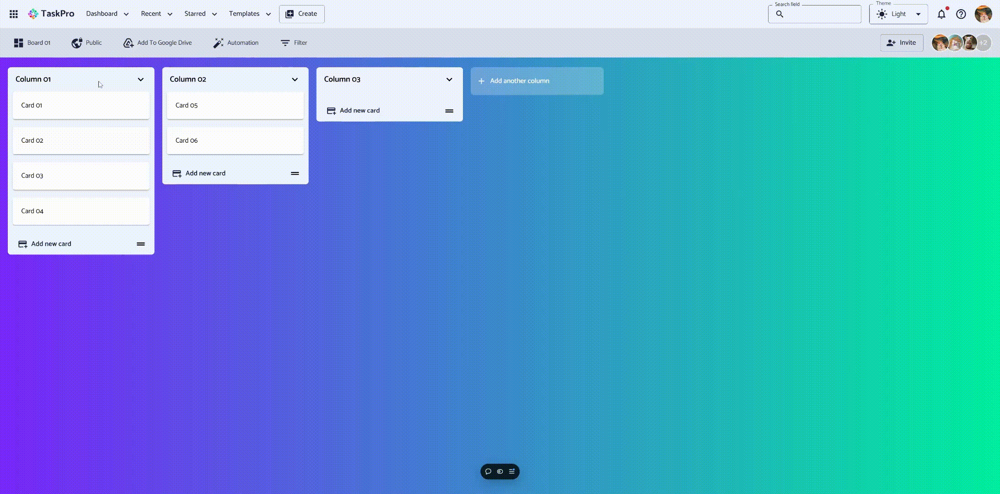

# TaskPro-Web

   

## Introduction

TaskPro is a Kanban-style task management application inspired by Trello. This repository houses the frontend code.

## Key Features

-   **Visual Task Organization:** Manage tasks effortlessly with customizable boards, columns, and cards.
-   **Intuitive Drag-and-Drop:** Rearrange tasks seamlessly with a smooth drag-and-drop interface.

## Tech Stack

-   **React (v18.x)**: Provides a dynamic and responsive user experience.
-   **Material-UI (MUI v5.x)**: Ensures a polished and professional user interface.
-   **DNDKit**: Powers the intuitive drag-and-drop functionality.
-   **Axios**: Facilitates smooth communication with the backend API.

## Development

-   **Vite**: Enables a fast and efficient development environment.
-   **ESLint**: Maintains clean and consistent code.

### Project Structure

-   **`~/apis`**: Handles mock data for testing and backend API interaction.
-   **`~/assets`**: Stores static assets like images and SVGs.
-   **`~/components`**: Houses reusable UI components.
-   **`~/pages`**: Contains major application components (e.g., Board, Authentication).
-   **`~/redux`**: Manages application state with Redux.
-   **`~/utils`**: Provides utility functions and shared variables.

## Getting Started

1.  Clone the repository: `git clone https://github.com/toanthienla/taskpro-web.git`
2.  Install dependencies: `npm install`
3.  Start the development server: `npm run dev`

## Contributing

Contributions are welcome! Feel free to submit issues and pull requests.

## License

[Specify your project's license here, e.g., MIT License]
