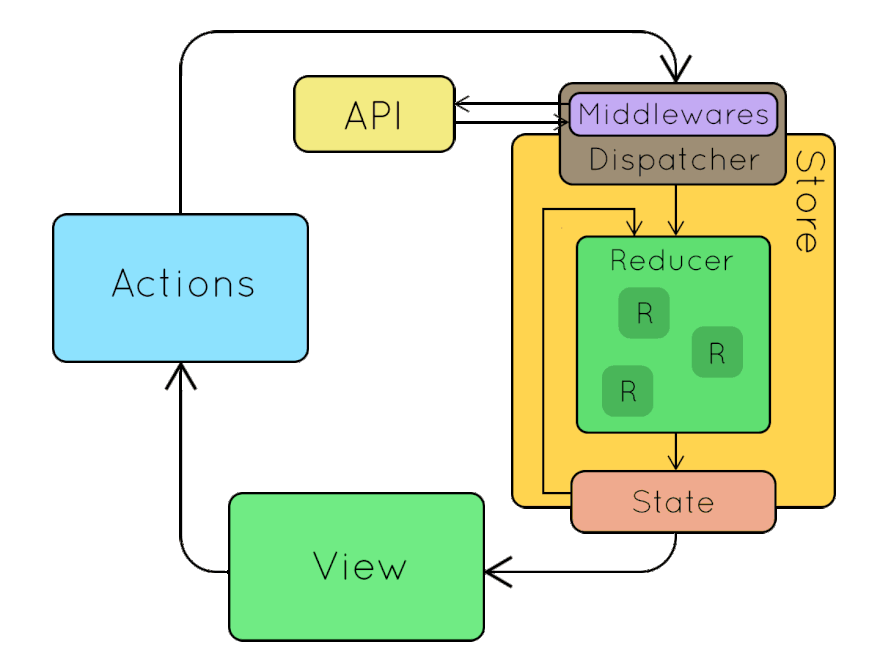
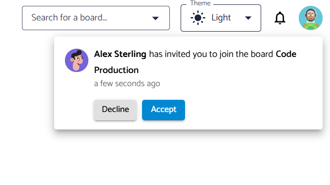
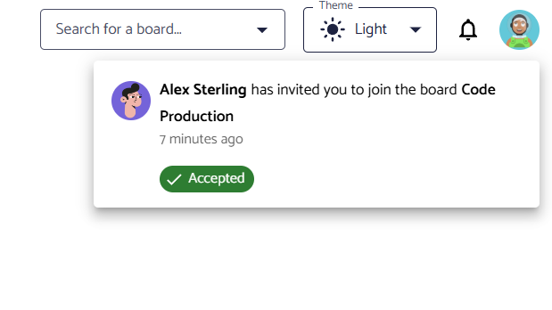
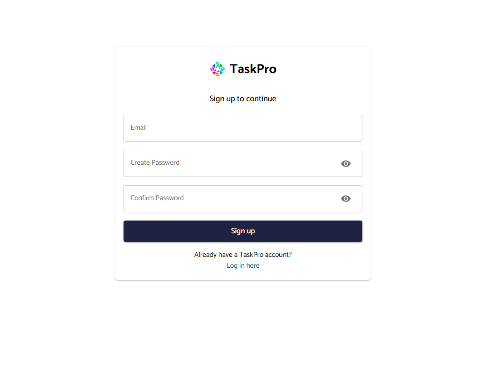
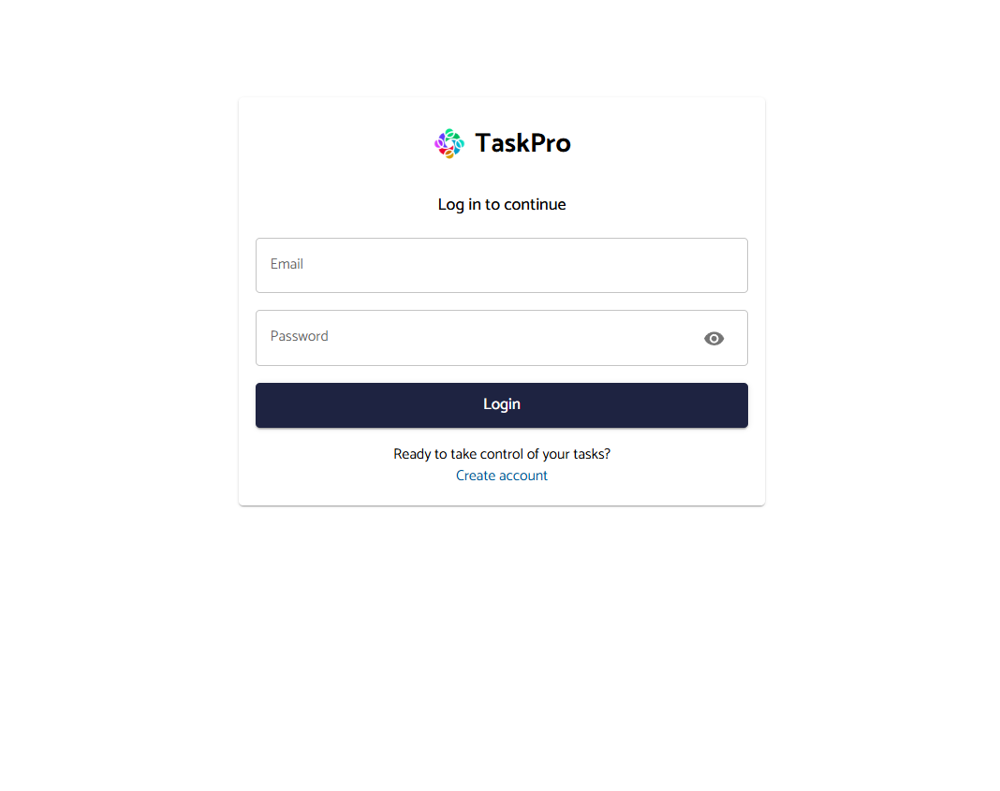
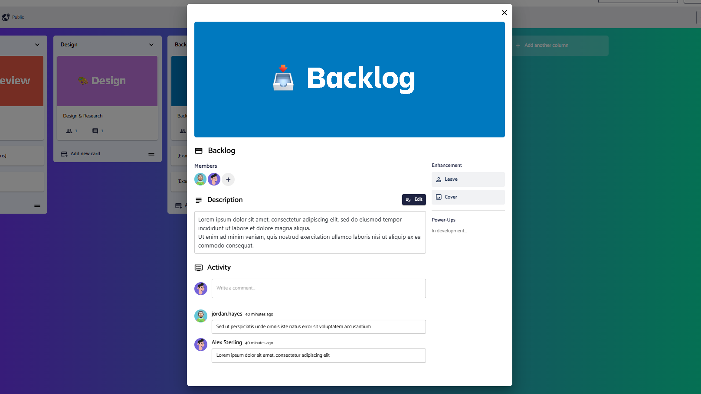

   

# TaskPro Web

A React-based Kanban-style task management app for organizing tasks and collaborating efficiently, drawing inspiration from Trello. This repository contains the frontend TaskPro implementation.

## Features

-   **📋 Kanban Boards**

    -   Drag-and-drop task management
    -   Customizable columns and cards
    -   Real-time updates

-   **🎨 Modern UI/UX**

    -   Material-UI components
    -   Responsive design
    -   Dark/Light theme support

-   **🔒 User Authentication**
    -   Secure login/signup
    -   Password protection
    -   Email verification
    -   User profile management

## Tech Stack

### Core Technologies

-   **React (v18+)**: Component-based UI library.
-   **Material-UI (MUI v5)**: Pre-styled UI components.
-   **DNDKit**: Drag-and-drop framework.
-   **Axios**: HTTP client for API requests.
-   **Redux**: State management tool.
-   **SocketIO**: Real-time communication.

### Supplementary Libraries

-   **React Toastify**: Toast notifications.
-   **React Router DOM**: Routing for React apps.
-   **React Hook Form**: Easy form management.
-   **React Markdown Editor**: Markdown input and preview.

### Development Tools

-   **Vite**: Fast build tool.
-   **ESLint**: Code quality checker.

## Project Structure

-   **`~/apis`**: API handlers.
-   **`~/assets`**: Static assets (e.g., images, SVGs).
-   **`~/components`**: Reusable UI components.
-   **`~/customHooks`**: Custom React hooks.
-   **`~/customLibraries`**: Custom config libraries.
-   **`~/pages`**: Main app screens (e.g., Board, Auth,...).
-   **`~/redux`**: Redux slices and store.
-   **`~/utils`**: Utility functions and constants.

## Getting Started

1.  Ensure you have Node.js version 18.x or higher installed.
2.  Clone the repository: `git clone https://github.com/toanthienla/taskpro-web.git`
3.  Install dependencies: `npm install`
4.  Start the development server: `npm run dev`

## 🎨 Design Showcase

   
   
   
   
   
   
  

## 🤝 Contributing

Contributions are welcome! Feel free to submit issues and pull requests.
